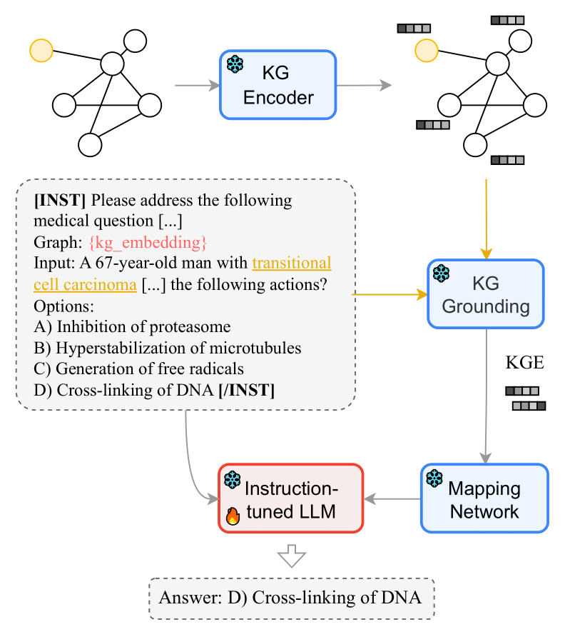

# <left>MEG </left>
We provide the source code and data of our paper [MEG: Medical Knowledge-Augmented Large Language Models for Question Answering](https://arxiv.org/abs/2411.03883)

<p align="center">
  
</p>

## 1\. Installation
Create a fresh conda environment and install all dependencies. 
You can do so from the YAML files provided. 
```text
conda env create --file=conda_env_meg-mistral.yml --name=meg
```
and/or
```text
conda env create --file=conda_env_meg-llama.yml --name=meg2
```

Both environments install **Python 3.11.5**; *conda_env_meg-mistral.yml* installs `pytorch-cuda=11.8` and *conda_env_meg-llama.yml* installs `pytorch-cuda=12.1`.

> As of the current release, MEG-Mistral models are based on mistralai/Mistral-7B-Instruct-v0.1 and mistralai/Mistral-7B-Instruct-v0.3. They can be run with either **deepspeed** or **torchrun**. The MEG-Llama model is based on meta-llama/Llama-3.2-3B-Instruct and is run with **torchrun** in the provided conda environment. 

#### 1.1\. Installation notes

* Make sure your CUDA version is compatible with the version that torch was compiled with. Visiting [Get Started @PyTorch](https://pytorch.org/get-started/locally/) may be helpful.  
* If you run into an `undefined symbol` error using Flash Attention, you may want to visit this [issue](https://github.com/Dao-AILab/flash-attention/issues/620).
* If you run into `no module named transformers.cache_utils`, this [discussion](https://huggingface.co/DiscoResearch/mixtral-7b-8expert/discussions/9#6576edcd0370e52e3b2c0620) may be helpful.


#### 1.2\. Configuration
* The main entry points to the run the code are in the [scripts/](scripts/) folder. You can find the configuration of paths in [main.config](main.config). Please, edit this file at your own convenience.
* Make sure you have been granted access to the base model from their Hugging Face page, e.g. [here](https://huggingface.co/meta-llama/Llama-3.1-8B-Instruct) if using a model based on MEG-Llama-3.1-8B-Instruct.  
* If necessary, you can uncomment L.17-18 in [modeling_meg.py](https://github.com/lautel/MEG/blob/main/src/meg/modeling_meg.py#L17) and replace the placeholder `your-hugginface-login-token` with your personal Hugging Face token.  

## 2\. Data

### 2.1\. UMLS data
You can download the preprocessed data from [here](https://drive.google.com/file/d/14Rx7bEpJW0_AOOIhsSkkrypNuUxvXRAX/view?usp=sharing) (339 MB). This includes the files needed for the Phase I of training (see Section 4.2 in our [paper](https://arxiv.org/pdf/2411.03883)):
* the UMLS vocabulary and the 297,927 corresponding instances to perform instruction tuning on the mapping network and the LLM.
* the trained Knowledge Graph Embeddings (KGE) on UMLS using GraphSAGE.

The resulting file structure should look like this:
```plain
.
└── umls/
      ├── neighbors_data_n25.jsonl
      ├── test_triplets.jsonl
      ├── triplets.jsonl
      ├── vocab_parents.jsonl
      ├── vocab_training_meg_extended.jsonl
      ├── vocab_training_meg.jsonl
      ├── vocab.csv

      └── embeddings/
            ├── word2embed_edgegraphsage_sapbertinit.h5
            └── word2embed_graphsage_sapbertinit.h5
```


### 2.2\. Question Answering (QA) data
We downloaded question-answering datasets from the following sources:

* MedQA-USMLE - We used the preprocessed data distributed by [DRAGON](https://github.com/michiyasunaga/dragon?tab=readme-ov-file#biomedical-domain)
* PubMedQA - [qiaojin/PubMedQA](https://huggingface.co/datasets/qiaojin/PubMedQA)
* MedMCQA - [openlifescienceai/medmcqa](https://huggingface.co/datasets/openlifescienceai/medmcqa)
* MMLU-Medical -  [cais/mmlu](https://huggingface.co/datasets/cais/mmlu)


## 3\. Train MEG

### 3.1\. Phase I training (UMLS)
You can find our trained MEG models at [Hugging Face](https://huggingface.co/collections/lautel/meg-67337ad69051eb36b6afd169). These checkpoints include MEG-Mistral and MEG-LLama trained on UMLS data.

### Usage Example

From the src/ folder:
```python
import torch
from collections import namedtuple
from meg.modeling_meg import MEGMistralModel
from config import MEGConfig

# Define basic input arguments
model_name_or_path="mistralai/Mistral-7B-Instruct-v0.3"
meg_model_name_or_path="lautel/MEG-Mistral-7B-Instruct-v0.3"
modelname="meg-mistral-instruct-v0.3"
device = torch.device("cuda") if torch.cuda.is_available() else torch.device("cpu")

DataInfo = namedtuple("data_args", ["model_name_or_path", "model_max_length", "xent_temperature", "temp"])
data_args = DataInfo(model_name_or_path, 512, 1.0, 0.5)
ModelInfo = namedtuple("model_args", ["resume_mapping_from_checkpoint", "mapping_type", "prefix_dim",  "num_layers_map_network", "num_heads_map_network"])
model_args = ModelInfo(meg_model_name_or_path, "mlp", 256, 4, 1)

# Load configuration
config = MEGConfig(
      task="medqa_usmle",
      modelname=modelname,
      mapping_type=model_args.mapping_type
)

# Load the model
model = MEGMistralModel.from_pretrained(
      pretrained_model_name_or_path=model_name_or_path,
      config=config,
      data_args=data_args, 
      model_args=model_args
)
tokenizer = model.get_tokenizer()

# Do Inference!
question = "Explain to me what you know about Clopidogrel"
tokenizer_out = tokenizer.encode(
      "[INST] " + question + " [/INST]", return_tensors="pt"
)
attention_mask = tokenizer_out.ne(tokenizer.pad_token_id).long()   
# For ease of explanation, we do not include the Clopidogrel's UMLS embedding here
# and simply pass an embedding of zeros
prefix = torch.zeros((1, model_args.prefix_dim)).to(device)

model.eval()
model.to(device)
output_ids = model.generate(
      task=None,
      prefix=prefix,
      input_ids=tokenizer_out.to(device),
      attention_mask=attention_mask.to(device),
      max_new_tokens=500,
      output_scores=True,
      return_dict_in_generate=False,
      debug=False,
)
outputs = tokenizer.batch_decode(
      output_ids,
      spaces_between_special_tokens=False, 
      skip_special_tokens=True
)
print(outputs[0])
```

> For a complete example on how to use the model on a downstream task, see, for instance, scripts/mistral/run_medqa_usmle.sh 

Otherwise, if you would like to train MEG on UMLS, download the data as detailed above, set the paths and environment variables as needed, and run
```
cd scripts/mistral/
bash train_meg_umls.sh
```

### 3.2\. Phase II training (QA dataset)
To fine-tune MEG on QA datasets, it is required to load MEG's weights from previous step (phase I). Please, update the value of the variable `umls_meg_ckpt` in the bash files accordingly.

To fine-tune MEG-Mistral on MedQA, PubMedQA, MedMCQA, MMLU-Medical, run:
```
cd scripts/mistral/

bash run_medqa_usmle.sh
bash run_pubmedqa.sh
bash run_medmcqa.sh
bash run_eval_mmlu_medical_from_medmcqa.sh
bash run_eval_mmlu_medical_from_medqa.sh
```

Similarly, to fine-tune MEG-Llama on MedQA, PubMedQA, MedMCQA, MMLU-Medical, run:
```
cd scripts/llama/

bash run_medqa_usmle.sh
bash run_pubmedqa.sh
bash run_medmcqa.sh
bash run_eval_mmlu_medical_from_medmcqa.sh
bash run_eval_mmlu_medical_from_medqa.sh
```

## 4\. License 
This work is licensed under the Apache License 2.0 license. See [`LICENSE`](LICENSE) for details. 
Third-party software and data sets are subject to their respective licenses. <br>
If you find our code/data/models or ideas useful in your research, please consider citing the paper:

```
@misc{cabello2024megmedicalknowledgeaugmentedlarge,
      title={MEG: Medical Knowledge-Augmented Large Language Models for Question Answering}, 
      author={Laura Cabello and Carmen Martin-Turrero and Uchenna Akujuobi and Anders Søgaard and Carlos Bobed},
      year={2024},
      eprint={2411.03883},
      archivePrefix={arXiv},
      primaryClass={cs.CL},
      url={https://arxiv.org/abs/2411.03883}, 
}
```
